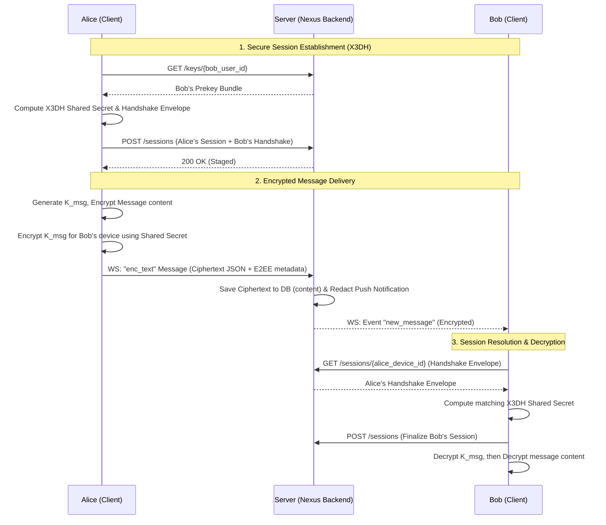

# End-to-End Encrypted (E2EE) Text Messaging Platform

Nexus v2.0 introduces secure, Zero-Knowledge End-to-End Encrypted (E2EE) text messaging. Plaintext messages are encrypted in the sender's client before transmission and decrypted in the recipient's client upon receipt. The server stores only base64-encoded ciphertext and cryptographic metadata, with zero access to private keys or plaintext.

---

## 1. Cryptographic Design

### Session Key Exchange (X3DH)
Pairwise device-to-device sessions are established peer-to-peer using the Extended Triple Diffie-Hellman (X3DH) protocol over Curve25519:
1. **Alice** (Sender) fetches **Bob's** (Recipient) prekey bundle containing:
   - Bob's Identity Key (`IK_B`)
   - Bob's Signed Prekey (`SPK_B`)
   - Bob's One-Time Prekey (`OPK_B`, if available)
2. Alice generates an Ephemeral Keypair (`EK_A`).
3. Alice computes the shared secret via:
   - `DH1 = DH(IK_A, SPK_B)`
   - `DH2 = DH(EK_A, IK_B)`
   - `DH3 = DH(EK_A, SPK_B)`
   - `DH4 = DH(EK_A, OPK_B)` (if available)
   - `Secret = HKDF-SHA256(DH1 || DH2 || DH3 [|| DH4], info="nexus-session-key")`
4. Bob fetches Alice's handshake info (containing `EK_A`, `IK_A`, and the prekey ID used) and derives the identical `Secret`.

### Symmetric Encryption (AES-GCM-256)
Text messages are encrypted using AES-GCM with a 256-bit key and a 96-bit (12 bytes) random Initialization Vector (IV/nonce):
1. The client generates a fresh random 32-byte message key (`K_msg`) for each text message.
2. The message plaintext is encrypted using `K_msg` and the random IV under AES-GCM.
3. For each active device of each participant (including the sender's other devices), the client encrypts `K_msg` using the derived pairwise session key and a device-specific random IV.
4. The ciphertext and the device-specific encrypted key map are packaged into a single JSON payload.

### Replay Attack Protection
To prevent replay and out-of-order attacks, the client attaches a monotonic sequence counter (`message_counter`) to every encrypted payload. The recipient stores the highest counter received from each peer device. Messages containing a counter less than or equal to the stored value are rejected.

---

## 2. Platform Architecture



---

## 3. Database Schema Changes

The `messages` table includes the following E2EE columns:
- **`encryption_version`**: A version identifier for the E2EE protocol (e.g. `"1"`).
- **`nonce`**: The base64-encoded initialization vector (IV) used to encrypt the message content.
- **`message_counter`**: The sender's monotonic sequence counter.
- **`algorithm`**: The symmetric encryption algorithm used (e.g. `"AES-GCM-256"`).
- **`sender_device_id`**: The device identifier string of the sending client.

The server database stores only the ciphertext JSON inside the `content` column:
```json
{
  "ciphertext": "base64_ciphertext_of_plaintext",
  "keys": {
    "bob_device_id_str": {
      "enc_key": "base64_encrypted_msg_key",
      "nonce": "base64_device_iv",
      "algo": "AES-GCM-256"
    }
  }
}
```

---

## 4. Portability & Mock Fallback
In environments where native Web Crypto API (`window.crypto.subtle`) is unavailable (such as HTTP development servers, command-line test suites, and React Native mobile client running without custom native crypto modules), the platform falls back to a deterministic **Mock Cryptography System**. This system mirrors the exact X3DH handshake, keys, schemas, and database columns using base64 obfuscation and deterministic key derivation, allowing complete end-to-end testability and feature parity across all targets.
