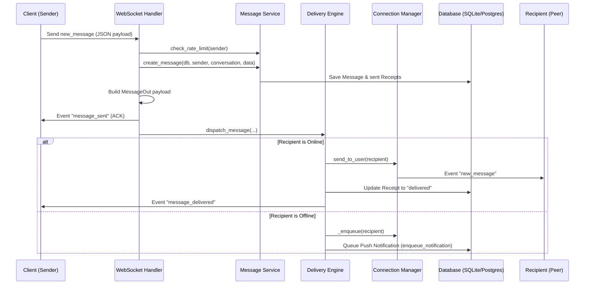

# secure messaging & real-time communication platform

Nexus secure messaging and real-time communication platform leverages a modular service architecture to isolate responsibilities: message validation, real-time dispatch, connection management, typing tracking, and read receipts.

## Architecture & Modules

The platform resides in `nexus-backend/messaging/` and exports the following services:

### 1. Connection Manager (`websocket_manager.py`)
- **Active Connection Registry**: Tracks active WebSocket connections per `user_id`.
- **Hybrid Offline Queueing**: Falls back to thread-safe in-memory collections when Redis is unavailable, guaranteeing system resilience.
- **Message Dispatch**: Flushes queued offline messages immediately upon client reconnect.
- **Presence Broadcasts**: Automatically informs mutual conversation participants of state changes when clients connect or disconnect.

### 2. Typing Manager (`typing_manager.py`)
- Tracks user typing statuses in real time.
- Employs a **4.0-second sliding expiration window** to clean up typing indicators automatically if a client stops typing or disconnects.

### 3. Attachment Service (`attachment_service.py`)
- Enforces strict size validation:
  - **Images & Audio**: Max 10MB
  - **PDF, Videos, & Documents**: Max 50MB
- Enforces extension and MIME-type consistency checks to prevent malicious masquerading.

### 4. Message Service (`message_service.py`)
- Handles database message creation and validation.
- Validates user conversation membership before allowing message sends.
- Enforces **Token Bucket Rate Limiting** (default capacity: 10 messages/10 seconds, refilling at 1 token/sec) per user.
- Performs ownership verification for editing and deleting messages.

### 5. Delivery Engine (`delivery_engine.py`)
- Resolves real-time message routing.
- Dispatches over active WebSocket connections for online participants.
- Cascades to push notification workers (`enqueue_notification`) and offline queues for offline participants.

### 6. Read Receipts Service (`read_receipts.py`)
- Coordinates status transitions: `pending` -> `sent` -> `delivered` -> `read` (seen).
- Bulk-marks historical receipts in a conversation up to a target message ID.
- Broadcasts real-time `message_delivered` and `message_read` events to peer participants.

---

## Technical Flow Diagram

